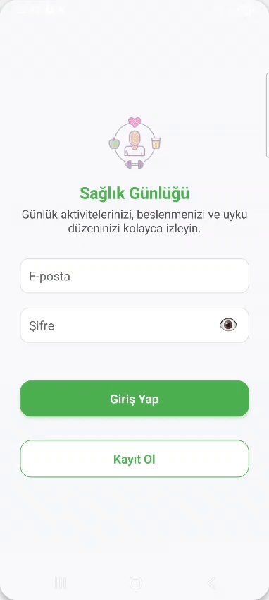

# 🩺 Sağlık Günlüğü Mobil Uygulaması

Merhaba! 👋  
Bu proje, **üniversite ikinci sınıfta başladığım** ve daha sonra geliştirmeye devam ederek **GitHub’a taşıdığım kişisel bir React Native (Expo) projesidir.**  

Amaç, kullanıcıların **kilo, uyku, su, adım ve kalori** gibi sağlık verilerini kolayca takip edebilmesi ve bunları **grafiklerle analiz edebilmesidir.**  
Veriler **Firebase** üzerinde güvenli bir şekilde saklanır. Uygulama, sağlıklı yaşam hedeflerinize ulaşırken **motivasyonunuzu yüksek tutmayı** hedefler! 💪

---

## 🎥📸 Ekran Görüntüsü

<p align="center">
  
  <br>
  <em>Uygulamanın temel işlevlerini gösteren kısa bir demo</em>
</p>

---

## ✨ Özellikler

- 🔐 **Güvenli Giriş & Kayıt:** E-posta veya Google hesabınızla kolayca giriş yapın.  
- 📝 **Günlük Veri Takibi:** Uyku, su, adım, kalori ve kilo bilgilerinizi saniyeler içinde kaydedin.  
- 🕒 **Geçmiş Görüntüleme:** Kayıtlarınızı tarih sırasına göre görüntüleyin.  
- ✏️ **Kayıt Düzenleme & Silme:** Hatalı verileri kolayca güncelleyin veya kaldırın.  
- 📊 **Grafik Analiz:** Günlük, haftalık ve aylık istatistikleri çizgi grafiklerle görüntüleyin.  
- 👤 **Profil Yönetimi:** Kişisel bilgilerinizi (ad, yaş, biyografi vb.) düzenleyin.  

---

## 🛠️ Kullanılan Teknolojiler

| Alan | Teknoloji |
|------|------------|
| **Mobil Geliştirme** | React Native (Expo) |
| **Dil** | TypeScript |
| **Backend** | Firebase (Authentication & Firestore) |
| **Navigasyon** | React Navigation |
| **UI & Animasyon** | React Native Reanimated, Expo Linear Gradient |
| **Grafikler** | React Native Chart Kit |
| **Yardımcı Araçlar** | Picker Select, Responsive Screen, Safe Area Context, Haptics |

---

## ⚙️ Kurulum ve Çalıştırma Kılavuzu

Projeyi kendi geliştirme ortamınızda kurup denemek için aşağıdaki basit adımları izleyin:

1.  **Projeyi Bilgisayarınıza İndirin (Klonlayın):**
    ```bash
    git clone [https://github.com/](https://github.com/)<kullanici_adiniz>/<repo_adiniz>.git
    cd <repo_adiniz>
    ```
    *( `<kullanici_adiniz>` ve `<repo_adiniz>` kısımlarını kendi GitHub bilgilerinizle değiştirin)*

2.  **Gerekli Paketleri Yükleyin:**
    ```bash
    npm install
    # veya eğer yarn kullanıyorsanız:
    yarn install
    ```

3.  **Firebase Projenizi Bağlayın:**
    * Bir Firebase projesi oluşturun ([https://console.firebase.google.com/](https://console.firebase.google.com/)).
    * Projenizde **Authentication** (E-posta/Şifre ile girişi etkinleştirin) ve **Firestore Database** (Test modunda başlatabilirsiniz) servislerini aktif hale getirin.
    * Proje ayarlarından **web uygulamanızın** yapılandırma bilgilerini (apiKey, authDomain vb.) kopyalayın.
    * Projenizin ana dizininde `.env` adında bir dosya oluşturun.
    * Kopyaladığınız Firebase yapılandırma bilgilerini, aşağıdaki gibi `EXPO_PUBLIC_` ön ekini kullanarak `.env` dosyasına yapıştırın:
        ```env
        EXPO_PUBLIC_FIREBASE_API_KEY=SIZIN_API_ANAHTARINIZ
        EXPO_PUBLIC_FIREBASE_AUTH_DOMAIN=siz-proje-id.firebaseapp.com
        EXPO_PUBLIC_FIREBASE_PROJECT_ID=sizin-proje-id
        EXPO_PUBLIC_FIREBASE_STORAGE_BUCKET=sizin-proje-id.appspot.com
        EXPO_PUBLIC_FIREBASE_MESSAGING_SENDER_ID=...
        EXPO_PUBLIC_FIREBASE_APP_ID=...
        ```
    * **Önemli:** `src/config/firebase.ts` dosyanızın bu `.env` değişkenlerini okuduğundan emin olun.

4.  **Uygulamayı Çalıştırın:**
    ```bash
    npx expo start
    ```
    * Telefonunuza **Expo Go** uygulamasını yükleyin (App Store / Google Play).
    * Expo Go'yu açın ve terminalde çıkan **QR kodu** taratarak uygulamayı başlatın.

## 📄 Lisans

Bu proje [MIT Lisansı](LICENSE) altındadır.

---

👨‍💻 **Developer:** Berat Baş  
🔗 [LinkedIn](https://www.linkedin.com/in/berat-baş-6a91a3274) | [GitHub](https://github.com/BeratBass)

---

> 🎯 *Bu proje, kişisel gelişim sürecimin bir parçası olarak geliştirilmiş olup; öğrenme, tasarım ve kullanıcı deneyimi odaklı bir mobil uygulama örneğidir.*
